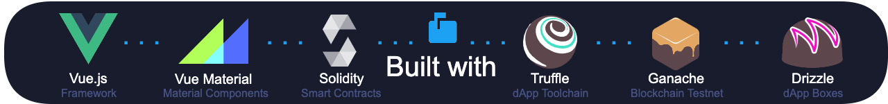
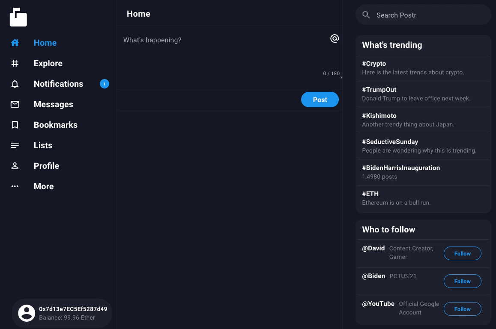
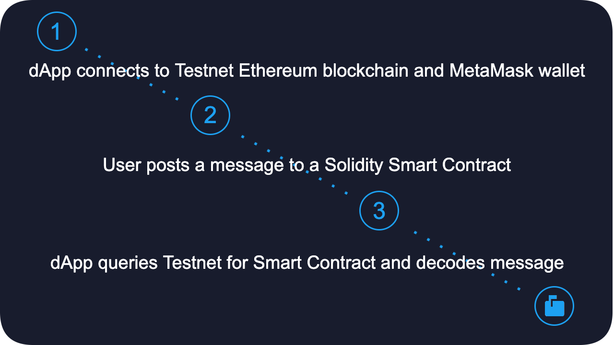

# Postr

![Shield](https://img.shields.io/badge/Smart%20Contracts-Solidity-181c2d?style=flat-square&logo=data%3Aimage%2Fpng%3Bbase64%2CiVBORw0KGgoAAAANSUhEUgAAADIAAAAyCAMAAAAp4XiDAAABm1BMVEUAAAAAAAAAAAAAAAAAAAAAAAAAAAAAAAAAAAAAAAAAAAAAAAAAAAAAAAAAAAAAAAAAAAAAAAAAAAAAAAAAAAAAAAAAAAAAAAAAAAAAAAAAAAAAAAAAAAAAAAAAAAAAAAAAAAAAAAAAAAAAAAAAAAAAAAAAAAAAAAAAAAAAAAAAAAAAAAAAAAAAAAAAAAAAAAAAAAAAAAAAAAAAAAAAAAAAAAAAAAAAAAAAAAAAAAAAAAAAAAAAAAAAAAAAAAAAAAAAAAAAAAAAAAAAAAAAAAAAAAAAAAAAAAAAAAAAAAAAAAAAAAAAAAAAAAAAAAAAAAAAAAAAAAAAAAAAAAAAAAAAAAAAAAAAAAAAAAAAAAAAAAAAAAAAAAAAAAAAAAAAAAAAAAAAAAAAAAAAAAAAAAAAAAAAAAAAAAAAAAAAAAAAAAAAAAAAAAAAAAAAAAAAAAAAAAAAAAAAAAAAAAAAAAAAAAAAAAAAAAAAAAAAAAAAAAAAAAAAAAAAAAAAAAAAAAAAAAATExM4ODhbW1tra2uLi4uampqpqan%2F%2F%2F8kH0GTAAAAiHRSTlMAAQIDBAUGCAkKCw0ODxAREhMUFRYXGBkbHB0eHyAhJCUnKSorLC0vMDIzNjc5Oz0%2BQEFCQ0RFRkpMTU5PUVZXWFxdX2FjZ2tsbW5vcXN2d3h6fH1%2Bf4CBhYaHiouMjpKVlpeZm5ydnqChpaanq6yytbe5uru8vb6%2Fw8THycrMzs%2FT2uHl6%2B7xTHqJOQAAAeBJREFUeNqM0wPSJGEQhOFa2%2Fpt27Zt27ZtvMfe6Jjm4Jt%2BTlDIFG%2BRaThER0oQ70ldxWYy9%2BG1qPVxHILNzyuaROk3UDqMqbUB%2BCIqC8DTVwxPnwFGRSEeTUsjurIhNKoL7JkLaMy11iWgUjwm8kCTtoJHlgTw%2Bh5dzDbAYgq68xfiXwuGzViAf4cYqsWvz1iyp6G%2FEss78WcCy%2FUP%2BPqMpVv8iMKutrOuA7s%2F4qv9wG757U8cZsVXbJpDxN9Ch1zx1YpDsahYX7HsiBtl2CSKK%2FuYZsSdZL8nVVtE1yVu%2FfMTj89RotSPhiqxjG2J0nufqIdBjijVeRdqA65fisqLS1gTSwZAnShlQoSYXpyh%2BShKWyNiqUHDgChFfRbTO3T%2FxK0edEvi0i9MaeLOHKYTcSUOm3JxYxe7txJcPg5t4iu30OFvRJpDrPiaweHn2%2BUDu3blSTXt9Z212EWLH13YfIVfF1jGxZ%2B3WCoGYToTy1fxqwrDyR%2BAhE0MzRLAKbq0ZYDtKHSPbySAdDyWk0FTNIFHiQS0DpqwA9DcfgfNkQQWimawAl1jK5okURgF%2BPKA4ds9MC8qn4D6dkzDZcE72cTND2zC9%2BkVtVd3BVPYrCbzQYL4P1l51OSphdGAAQAmesZfEpyGYAAAAABJRU5ErkJggg%3D%3D)




**Postr** showcases a Twitter-like decentralized app (dApp) where Tweets are stored anonymously on the blockchain.

## Abstract
Social media platforms are said to be the *"town square of the 21st century"*. Millions of people rely on news and opinion from these platforms every day, which introduces a new problem of consolidated power over information. Ethereum Co-founder, Vitalik Buterin, [proposed](https://blockonomi.com/ethereum-blockchain-censorship/) that the blockchain could be used to create a censorship-free platform. **Postr** demonstrates this idea with the ability to send, store, and read a message entirely on the blockchain by using smart contracts.

## Demo


## How does it work?


## Where's the Blockchain?
The blockchain for **Postr** was setup and tested in a local Ethereum testnet using [Ganache](https://www.trufflesuite.com/ganache). It communicates over an RPC Server at `http://127.0.0.1:7545`. The gif below shows the accounts, blocks, transactions and contracts associated with the Testnet. The `Post` contract is what initiates the "tweet" and stores the message on the blockchain. For example, you can see the hex stored is `0x746573742061626320313233` which translates to `test abc 123` in UTF-8.


## What's a Smart Contract?
The smart contract is the primary mechanism for interacting with the Ethereum blockchain. A smart contract can store information, communicate with applications, or even chain smart contracts together to create robust end products. **Postr** has only one smart contract called `Post` where it stores a message as a type `string` and emits an event. This is as simple as it gets.
```Solidity
contract Post {
    event StorageSet(string _message);
    string public storedData;
    
    function post(string memory x) public {
        storedData = x;
        emit StorageSet("Posted!");
    }
}
```
Ethereum smart contracts are written in [Solidity](https://docs.soliditylang.org/), a high-level Object-Oriented language which is statically typed. This means that contracts are first written, compiled, then deployed to the blockchain. `Web3.js` allows the `Vue.js` app to communicate to the testnet and invoke the smart contract's `post()` method. By doing so, it creates a Transaction Hash which can be used to query the blockchain for the transaction.

## Considerations
**Postr** was created as an exhibition to show the potential of a decentralized social media platform. Currently, Ethereum 1.0 requires a small gas fee in order to submit smart contracts to the blockchain. This gas fee is used to compensate the miner with a reward when the block is processed. This system is called "Proof of Work," but Ethereum 2.0 will move to a staking model. The new staking system should bring the barrier-to-entry to a minimum, where currently paying a fee to post a message is not a viable model.

## Upgrades
Future upgrades to **Postr** may include:
* Integrate [InterPlanetary File System](https://ipfs.io/) (IPFS) to post decentralized media content, such as images or videos
* Add the ability to post multiple messages, dynamically creating a list of posts
* Create a NoSQL database to store Transaction Hashes, which can be used to dynamically populate posts
* Provide Gravatar option for users to help recognize each other
* And much more
